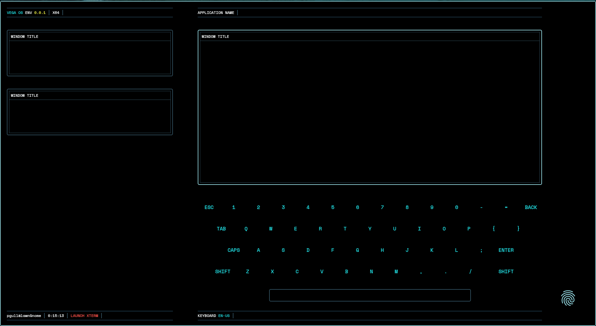

# Vega
This was an old project for a Raspberri Pi where I tried to replicate the Encom OS interface as an operating environment for Linux. I'm unsure where most of the project went or if everything was committed to this repo. It had a window manager that would transition windows back and forth from the left-hand sidebar to the space above the keyboard with newly opened apps replacing the active window and the active window minimizing to the sidebar. The interface was built in HTML and CSS and would send system events through Node.

As of writing, this project is nearly 10 years old with no commits. I have not looked at the source code since or have made any attempt to run it. I can't even remember how. If you want to check it out, good luck!

